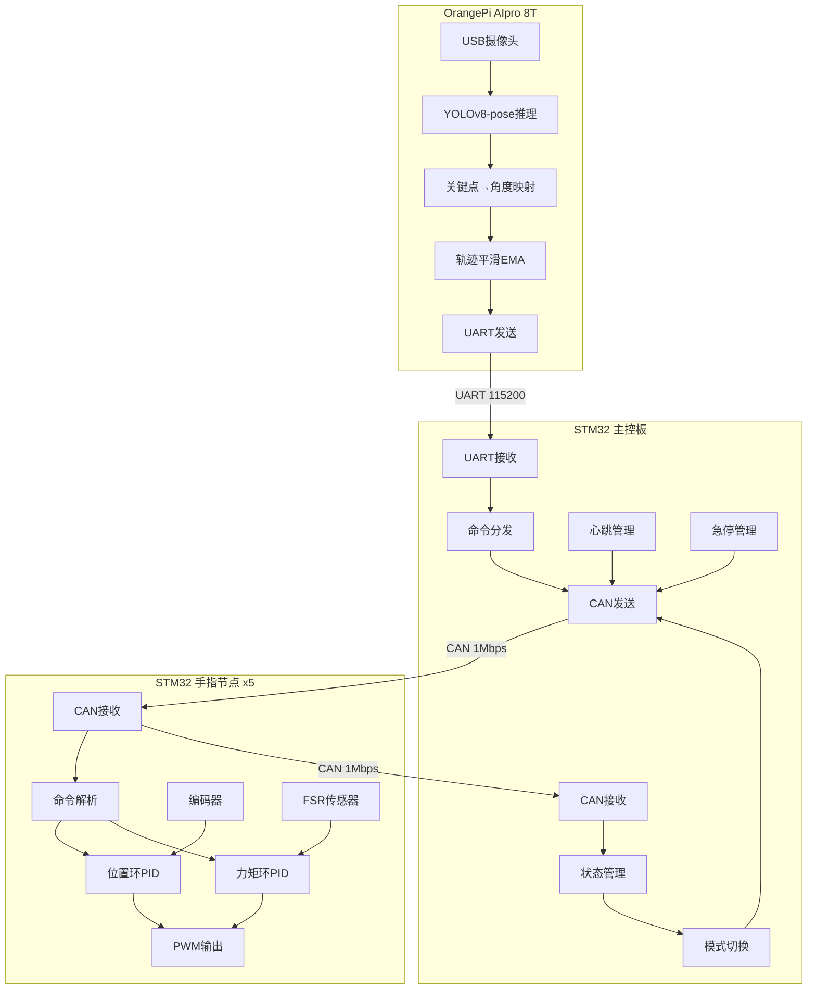
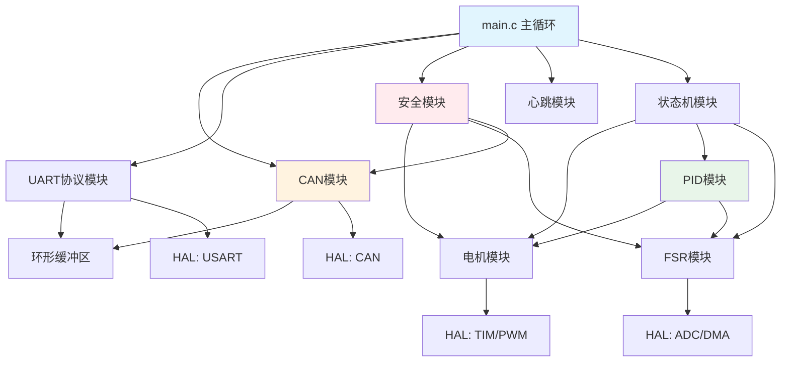
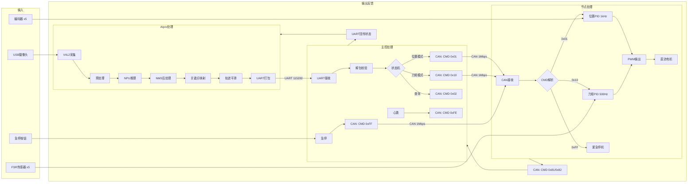
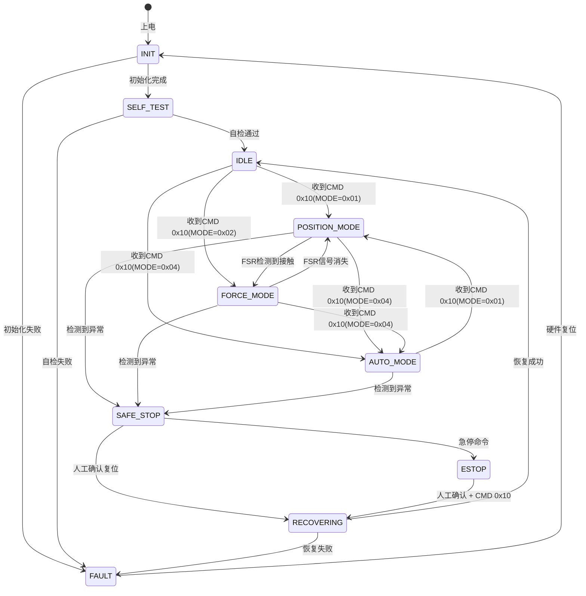

# 软件架构设计文档

> 本文档定义了灵巧手控制系统的完整软件架构，涵盖STM32固件和AIpro视觉推理两大子系统的分层设计、模块划分、数据流及状态机。

---

## 一、整体架构概述

### 1.1 分层架构

系统采用经典的四层分层架构，各层职责明确，层间通过标准化接口通信：

```
┌─────────────────────────────────────────────────────────────────┐
│                        应用层 (Application)                      │
│  ┌──────────────┐  ┌──────────────┐  ┌────────────────────────┐ │
│  │ AIpro:       │  │ STM32 主控:  │  │ STM32 节点:            │ │
│  │ 手势识别应用  │  │ 手势跟踪控制  │  │ 本地PID控制           │ │
│  │ 关键点映射    │  │ 模式管理      │  │ 安全保护              │ │
│  │ 轨迹平滑      │  │ 状态监控      │  │ 数据采集              │ │
│  └──────┬───────┘  └──────┬───────┘  └──────────┬─────────────┘ │
├─────────┼──────────────────┼─────────────────────┼───────────────┤
│         │           协议层 (Protocol)             │               │
│  ┌──────┴───────┐  ┌──────┴───────┐  ┌──────────┴─────────────┐ │
│  │ AIpro:       │  │ 主控:        │  │ 节点:                  │ │
│  │ UART帧协议    │  │ CAN协议栈    │  │ CAN协议解析            │ │
│  │ CRC校验       │  │ 命令分发      │  │ UART帧协议             │ │
│  └──────┬───────┘  └──────┬───────┘  └──────────┬─────────────┘ │
├─────────┼──────────────────┼─────────────────────┼───────────────┤
│         │           驱动层 (Driver)               │               │
│  ┌──────┴───────┐  ┌──────┴───────┐  ┌──────────┴─────────────┐ │
│  │ AIpro:       │  │ 主控:        │  │ 节点:                  │ │
│  │ V4L2摄像头    │  │ CAN驱动      │  │ CAN驱动                │ │
│  │ UART驱动      │  │ UART驱动     │  │ PWM驱动                │ │
│  │ CANN ACL      │  │ ADC+DMA驱动  │  │ 编码器驱动             │ │
│  │ GPIO控制      │  │ PWM驱动      │  │ ADC驱动                │ │
│  └──────┬───────┘  └──────┬───────┘  └──────────┬─────────────┘ │
├─────────┼──────────────────┼─────────────────────┼───────────────┤
│         │        硬件抽象层 (HAL/BSP)             │               │
│  ┌──────┴───────┐  ┌──────┴───────┐  ┌──────────┴─────────────┐ │
│  │ Ascend NPU   │  │ STM32 HAL    │  │ STM32 HAL              │ │
│  │ Linux Kernel │  │ CMSIS        │  │ CMSIS                  │ │
│  └──────────────┘  └──────────────┘  └────────────────────────┘ │
└─────────────────────────────────────────────────────────────────┘
```

### 1.2 系统组件关系



---

## 二、STM32固件架构

### 2.1 代码目录结构

```
firmware/
├── main_ctrl/                          # 主控板固件
│   ├── Core/
│   │   ├── Inc/
│   │   │   ├── main.h                  # 主程序头文件
│   │   │   ├── stm32f4xx_it.h          # 中断处理头文件
│   │   │   └── stm32f4xx_hal_conf.h    # HAL配置
│   │   └── Src/
│   │       ├── main.c                  # 主程序入口
│   │       ├── stm32f4xx_it.c          # 中断服务函数
│   │       └── system_stm32f4xx.c      # 系统初始化
│   ├── Drivers/
│   │   ├── STM32F4xx_HAL_Driver/       # ST官方HAL库
│   │   └── CMSIS/                      # ARM CMSIS头文件
│   ├── Modules/
│   │   ├── can_protocol.h/c            # CAN协议栈
│   │   ├── uart_protocol.h/c           # UART帧协议 (AIpro通信)
│   │   ├── motor_ctrl.h/c              # 电机控制接口
│   │   ├── fsr_sensor.h/c              # FSR采集与滤波
│   │   ├── pid_controller.h/c          # PID控制器
│   │   ├── safety.h/c                  # 安全保护模块
│   │   ├── heartbeat.h/c               # 心跳管理
│   │   └── state_machine.h/c           # 系统状态机
│   ├── Config/
│   │   ├── can_config.h                # CAN参数配置
│   │   ├── motor_config.h              # 电机参数配置
│   │   └── pid_params.h                # PID参数默认值
│   └── STM32F407VETx.ioc               # CubeMX工程文件
│
├── node/                               # 手指节点固件
│   ├── Core/
│   │   ├── Inc/
│   │   │   ├── main.h
│   │   │   └── stm32f4xx_it.h
│   │   └── Src/
│   │       ├── main.c
│   │       └── stm32f4xx_it.c
│   ├── Modules/
│   │   ├── can_node.h/c                # CAN节点通信
│   │   ├── motor_driver.h/c            # 电机驱动 (PWM+方向)
│   │   ├── encoder.h/c                 # 编码器读取
│   │   ├── fsr_adc.h/c                 # FSR ADC采集
│   │   ├── pid_position.h/c            # 位置环PID
│   │   ├── pid_force.h/c               # 力矩环PID
│   │   └── safety_node.h/c             # 节点安全保护
│   └── Config/
│       ├── node_id.h                   # 节点ID配置
│       └── pid_default.h               # 默认PID参数
│
└── common/                             # 共享代码
    ├── protocol_def.h                  # 协议定义 (CAN ID, CMD等)
    ├── crc.h/c                         # CRC校验函数
    ├── ring_buffer.h/c                 # 环形缓冲区
    └── debug_print.h/c                 # 调试打印宏
```

### 2.2 模块划分与职责

#### CAN模块 (`can_protocol.h/c`)

| 函数 | 说明 |
|------|------|
| `CAN_Init()` | CAN外设初始化，配置波特率和过滤器 |
| `CAN_SendFrame(id, cmd, data, len)` | 发送CAN帧 |
| `CAN_RegisterCallback(cmd, handler)` | 注册命令回调函数 |
| `CAN_ProcessRx()` | 处理接收队列中的帧 (在主循环调用) |
| `CAN_GetRxCount()` | 获取接收帧计数 |

#### 电机模块 (`motor_ctrl.h/c`)

| 函数 | 说明 |
|------|------|
| `Motor_Init()` | 初始化PWM和GPIO |
| `Motor_SetPWM(channel, duty)` | 设置PWM占空比 (-1000~+1000) |
| `Motor_SetDirection(motor, dir)` | 设置电机方向 (CW/CCW/BRAKE/COAST) |
| `Motor_Stop(motor)` | 停止指定电机 |
| `Motor_StopAll()` | 停止所有电机 (急停用) |
| `Motor_GetPosition(motor)` | 获取编码器位置 |

#### FSR模块 (`fsr_sensor.h/c`)

| 函数 | 说明 |
|------|------|
| `FSR_Init()` | 初始化ADC+DMA |
| `FSR_StartConversion()` | 启动ADC采样 |
| `FSR_GetRawValue(channel)` | 获取原始ADC值 (0~4095) |
| `FSR_GetForce(channel)` | 获取滤波后的力值 (单位: 0.01N) |
| `FSR_Calibrate(channel, ref_force)` | 标定FSR传感器 |

#### PID模块 (`pid_controller.h/c`)

| 函数 | 说明 |
|------|------|
| `PID_Init(pid, kp, ki, kd)` | 初始化PID控制器 |
| `PID_Compute(pid, target, actual)` | 计算PID输出 |
| `PID_SetParams(pid, kp, ki, kd)` | 动态修改PID参数 |
| `PID_Reset(pid)` | 重置积分项和历史误差 |
| `PID_SetOutputLimits(pid, min, max)` | 设置输出限幅 |

#### 安全模块 (`safety.h/c`)

| 函数 | 说明 |
|------|------|
| `Safety_Init()` | 初始化安全保护 (急停按钮中断等) |
| `Safety_CheckStall(motor)` | 检测电机堵转 |
| `Safety_CheckOvercurrent()` | 检测过流 |
| `Safety_CheckJointLimit(finger, angle)` | 检查关节限位 |
| `Safety_EmergencyStop(reason)` | 触发紧急停止 |
| `Safety_Recover()` | 从安全状态恢复 |

### 2.3 模块间依赖关系图



### 2.4 中断优先级分配表

| 优先级 (数字越小越高) | 中断源 | 说明 | 最大执行时间 |
|----------------------|--------|------|------------|
| 0 (最高) | EXTI13 (PC13) | 物理急停按钮 | < 10us |
| 1 | TIM6_DAC | PID控制定时中断 (1kHz) | < 100us |
| 2 | CAN1_RX0 | CAN接收中断 | < 50us |
| 3 | DMA2_Stream0 | ADC DMA完成中断 | < 10us |
| 4 | USART1_RX | UART调试接收 | < 20us |
| 5 | USART2_RX | AIpro UART接收 | < 20us |
| 6 | TIM7 | 心跳定时器 (100ms) | < 5us |
| 7 (最低) | SysTick | 系统滴答 (1ms) | < 5us |

### 2.5 任务调度方式

系统采用**主循环 + 定时器中断**的协作式调度模型：

```
主循环 (Super Loop) - 尽可能快地循环
├── CAN_ProcessRx()         // 处理CAN接收队列
├── UART_ProcessRx()        // 处理UART接收队列
├── StateMachine_Update()   // 更新状态机
├── Heartbeat_Check()       // 检查节点在线状态
├── Debug_Print()           // 调试信息输出 (低优先级)
└── __WFI()                 // 等待中断 (省电)

定时器中断 (TIM6, 1kHz)
├── FSR采样 + 滤波
├── PID位置环计算
├── 电机PWM输出更新
└── 关节限位检查

定时器中断 (TIM7, 100Hz)
├── 心跳帧发送
├── 统计信息更新
└── 看门狗喂狗

外部中断 (EXTI13, 下降沿)
└── 立即关闭所有电机PWM (硬件级急停)
```

**时间片分配估算**：

| 任务 | 频率 | 单次耗时 | CPU占用率 |
|------|------|---------|----------|
| PID中断 (TIM6) | 1000Hz | ~80us | 8% |
| CAN接收处理 | ~500Hz | ~20us | 1% |
| UART接收处理 | ~30Hz | ~30us | 0.1% |
| 主循环其他任务 | ~10kHz | ~10us | 10% |
| **总占用** | | | **~19%** |

> Cortex-M4F @ 168MHz 能够轻松承载上述负载，留有充足余量用于调试打印和未来功能扩展。

---

## 三、AIpro视觉推理架构

### 3.1 代码目录结构

```
aipro_vision/
├── main.py                     # 主程序入口
├── config.yaml                 # 配置文件 (摄像头ID、串口、模型路径等)
├── requirements.txt            # Python依赖
│
├── model/
│   ├── yolov8n_hand_pose.onnx  # ONNX模型 (备用)
│   ├── yolov8n_hand_pose.om    # CANN OM模型 (主用)
│   └── hand_keypoints.yaml     # 关键点定义文件
│
├── core/
│   ├── __init__.py
│   ├── detector.py             # 目标检测器 (封装CANN推理)
│   ├── keypoint_mapper.py      # 关键点→关节角度映射
│   ├── trajectory_smooth.py    # 轨迹平滑 (EMA + 死区)
│   └── hand_tracker.py         # 手部跟踪 (多帧关联)
│
├── comm/
│   ├── __init__.py
│   ├── uart_sender.py          # UART串口通信
│   └── protocol.py             # UART帧协议编解码
│
├── utils/
│   ├── __init__.py
│   ├── fps_counter.py          # FPS计数器
│   ├── logger.py               # 日志模块
│   └── visualization.py        # 可视化 (调试用)
│
└── test/
    ├── test_detector.py        # 检测器测试
    ├── test_mapper.py          # 映射算法测试
    └── test_uart.py            # UART通信测试
```

### 3.2 推理Pipeline流程

```
摄像头采集 (V4L2, 640x480@30fps)
    │
    ▼
[图像预处理]
    - Resize → 640×640
    - BGR→RGB
    - 归一化 [0, 255] → [0, 1]
    - 转CHW格式
    │
    ▼
[NPU推理]
    - CANN ACL加载OM模型
    - INT8量化推理
    - 输出: 边界框 + 21个关键点坐标
    │
    ▼
[后处理]
    - NMS非极大值抑制
    - 置信度过滤 (>0.5)
    - 坐标反归一化到原图尺寸
    │
    ▼
[关键点→关节角度映射]
    - 计算各手指关节向量夹角
    - 映射为5个目标角度
    │
    ▼
[轨迹平滑]
    - EMA指数移动平均 (alpha=0.3)
    - 死区滤波 (变化<2度忽略)
    │
    ▼
[UART发送]
    - 打包为13字节帧
    - CRC8校验
    - 通过UART发送给STM32主控
```

### 3.3 关键类/函数设计

#### Detector 类 (`core/detector.py`)

```python
class HandDetector:
    def __init__(self, model_path: str, conf_threshold: float = 0.5):
        """
        初始化CANN推理引擎
        :param model_path: OM模型路径
        :param conf_threshold: 置信度阈值
        """
        self.model_path = model_path
        self.conf_threshold = conf_threshold
        self._init_acl()  # 初始化ACL runtime

    def detect(self, frame: np.ndarray) -> list:
        """
        检测手部关键点
        :param frame: BGR图像 (H, W, 3)
        :return: [{"bbox": [x1,y1,x2,y2], "keypoints": (21,3), "confidence": float}]
        """
        preprocessed = self._preprocess(frame)
        raw_output = self._infer(preprocessed)
        return self._postprocess(raw_output, frame.shape)

    def _preprocess(self, frame): ...
    def _infer(self, input_data): ...
    def _postprocess(self, output, orig_shape): ...
```

#### KeypointMapper 类 (`core/keypoint_mapper.py`)

```python
class KeypointMapper:
    # MediaPipe 21关键点索引定义
    FINGER_JOINTS = {
        'thumb':  [1, 2, 3, 4],       # CMC, MCP, IP, TIP
        'index':  [5, 6, 7, 8],       # MCP, PIP, DIP, TIP
        'middle': [9, 10, 11, 12],    # MCP, PIP, DIP, TIP
        'ring':   [13, 14, 15, 16],   # MCP, PIP, DIP, TIP
        'pinky':  [17, 18, 19, 20],   # MCP, PIP, DIP, TIP
    }

    def __init__(self, angle_range: dict = None):
        """初始化角度映射范围"""
        self.angle_range = angle_range or {
            'thumb': (0, 90), 'index': (0, 90),
            'middle': (0, 90), 'ring': (0, 90), 'pinky': (0, 90)
        }

    def map_to_angles(self, keypoints_2d: np.ndarray) -> dict:
        """
        将21个2D关键点映射为5个手指的目标角度
        :param keypoints_2d: (21, 2) 或 (21, 3)
        :return: {"thumb": float, "index": float, ...} 角度值(度)
        """
        angles = {}
        for finger, joints in self.FINGER_JOINTS.items():
            angle = self._compute_finger_angle(keypoints_2d, joints)
            angle = self._normalize_angle(angle, self.angle_range[finger])
            angles[finger] = angle
        return angles

    def _compute_finger_angle(self, kpts, joints): ...
    def _normalize_angle(self, angle, range): ...
```

#### TrajectorySmooth 类 (`core/trajectory_smooth.py`)

```python
class TrajectorySmooth:
    def __init__(self, alpha: float = 0.3, deadband: float = 2.0):
        """
        :param alpha: EMA系数 (0~1, 越小越平滑)
        :param deadband: 死区 (度, 变化小于此值忽略)
        """
        self.alpha = alpha
        self.deadband = deadband
        self.prev = None

    def smooth(self, angles: dict) -> dict:
        """对5个手指角度进行平滑"""
        if self.prev is None:
            self.prev = angles.copy()
            return angles

        result = {}
        for finger, current in angles.items():
            prev_val = self.prev.get(finger, current)
            delta = current - prev_val
            # 死区处理
            if abs(delta) < self.deadband:
                delta = 0
            # EMA
            smoothed = prev_val + self.alpha * delta
            result[finger] = smoothed
            self.prev[finger] = smoothed
        return result
```

---

## 四、数据流图

### 4.1 完整数据流 (摄像头→电机)



### 4.2 数据延迟预算

| 环节 | 典型延迟 | 最大延迟 |
|------|---------|---------|
| 摄像头曝光+传输 | 15ms | 33ms |
| 图像预处理 | 2ms | 5ms |
| NPU推理 | 20ms | 33ms |
| 后处理+映射+平滑 | 3ms | 5ms |
| UART传输 (13B @ 115200) | 1.1ms | 1.5ms |
| 主控接收+CAN转发 | 0.5ms | 1ms |
| CAN传输 (8B @ 1Mbps) | 0.13ms | 0.2ms |
| 节点PID计算 | 0.08ms | 0.1ms |
| **端到端总计** | **~42ms** | **~80ms** |

---

## 五、状态机设计

### 5.1 系统状态定义



### 5.2 状态转移条件

| 当前状态 | 目标状态 | 触发条件 | 动作 |
|---------|---------|---------|------|
| INIT | SELF_TEST | 所有外设初始化成功 | 开始自检 |
| INIT | FAULT | 初始化失败 | LED_ERR亮 |
| SELF_TEST | IDLE | CAN通信测试通过、电机回零 | 进入待机 |
| IDLE | POSITION_MODE | 收到CMD 0x10, MODE=0x01 | 激活位置环 |
| POSITION_MODE | FORCE_MODE | FSR力值 > CONTACT_THRESHOLD (0.5N) | 切换力矩环 |
| FORCE_MODE | POSITION_MODE | FSR力值 < RELEASE_THRESHOLD (0.2N) 持续100ms | 切回位置环 |
| * (任意) | SAFE_STOP | 电机堵转/过流/关节超限 | 停机保护 |
| * (任意) | ESTOP | 收到CMD 0xFF或物理急停 | 立即停机 |
| SAFE_STOP | RECOVERING | 人工复位按钮 + 收到CMD 0x10 | 尝试恢复 |
| RECOVERING | IDLE | 电机回零成功 | 恢复待机 |

### 5.3 自动模式(AUTO_MODE)内部逻辑

```
AUTO_MODE 是默认工作模式，内部自动切换位置/力矩:

if (FSR_GetForce(finger) > CONTACT_THRESHOLD) {
    // 检测到接触物体
    if (control_mode[finger] != MODE_FORCE) {
        // 首次接触: 记录当前角度，切换为力矩模式
        capture_angle[finger] = encoder_get(finger);
        target_force[finger] = GRASP_FORCE;  // 默认5N
        control_mode[finger] = MODE_FORCE;
    }
    // 力矩PID持续运行
} else {
    // 未接触
    if (control_mode[finger] == MODE_FORCE) {
        // 刚释放: 切回位置模式，目标角度=松开角度
        target_angle[finger] = RELEASE_ANGLE;
        control_mode[finger] = MODE_POSITION;
    }
    // 位置PID跟踪视觉下发的目标角度
}
```

---

## 六、错误处理策略

### 6.1 错误分类与响应

| 错误类别 | 具体错误 | 检测方式 | 响应动作 | 严重等级 |
|---------|---------|---------|---------|---------|
| **硬件错误** | 电机堵转 | 编码器无变化+PWM>80%持续500ms | 停止该电机，标记故障 | 高 |
| | 过流保护 | 采样电阻+比较器触发中断 | 立即停止，硬件级Fail-Safe | 高 |
| | 传感器故障 | ADC读数恒为0或满量程 | 降级为纯位置控制 | 中 |
| **通信错误** | CAN总线错误 | TEC/REC计数器超阈值 | 复位CAN控制器 | 中 |
| | 节点离线 | 心跳超时500ms | 停止对应手指，LED告警 | 高 |
| | UART通信丢失 | AIpro无数据超过1秒 | 保持最后角度，切换为本地模式 | 中 |
| **软件错误** | 关节角度超限 | 目标角度超出MIN/MAX范围 | 自动钳位到限位值 | 低 |
| | PID积分饱和 | 积分项超过阈值 | 积分限幅 | 低 |
| | 看门狗复位 | 看门狗超时 | 系统重启 | 高 |

### 6.2 错误处理状态机

```
正常运行 (NORMAL)
    │
    ├── 检测到可恢复错误 (传感器故障、通信丢失)
    │   → 降级运行 (DEGRADED)
    │   → LED_ERR闪烁
    │   → 系统继续运行，功能受限
    │
    ├── 检测到严重错误 (堵转、过流)
    │   → 安全停机 (SAFE_STOP)
    │   → 停止相关电机
    │   → LED_ERR常亮
    │   → 等待人工复位
    │
    └── 收到急停命令 / 物理急停
        → 紧急停机 (ESTOP)
        → 所有电机立即断电
        → LED_ERR快闪 + 蜂鸣器
        → 等待人工复位 + 重新初始化
```

### 6.3 看门狗配置

| 看门狗 | 超时时间 | 喂狗条件 | 说明 |
|--------|---------|---------|------|
| IWDG (独立看门狗) | 500ms | 主循环正常运行 | 防止主循环卡死 |
| WWDG (窗口看门狗) | 不使用 | — | IWDG已足够 |

### 6.4 错误日志

错误事件通过调试串口输出，格式如下：

```
[ERROR] 12345ms STALL motor=2 pwm=850 duration=501ms
[ERROR] 12400ms NODE_OFFLINE node_id=3 last_ack=11900ms
[WARN]  12500ms SENSOR_DEGRADED finger=4 adc=0
[INFO]  13000ms RECOVERED node_id=3
```

---

## 附录A：关键配置参数汇总

| 参数 | 值 | 说明 |
|------|-----|------|
| PID位置环频率 | 1000Hz | TIM6中断 |
| PID力矩环频率 | 500Hz | TIM6分频 |
| PWM频率 | 20kHz | TIM1 |
| ADC采样率 | 1000Hz | DMA传输 |
| CAN波特率 | 1Mbps | |
| UART波特率 | 115200 | AIpro通信 |
| 心跳周期 | 100ms | TIM7 |
| 心跳超时 | 500ms | |
| 接触力阈值 | 0.5N | 位置→力矩切换 |
| 释放力阈值 | 0.2N | 力矩→位置切换 |
| 默认抓取力 | 5N | |
| 堵转检测时间 | 500ms | |
| 过流阈值 | 2A | 硬件比较器 |
| 关节角度范围 | 0~90度 | 各手指不同 |
